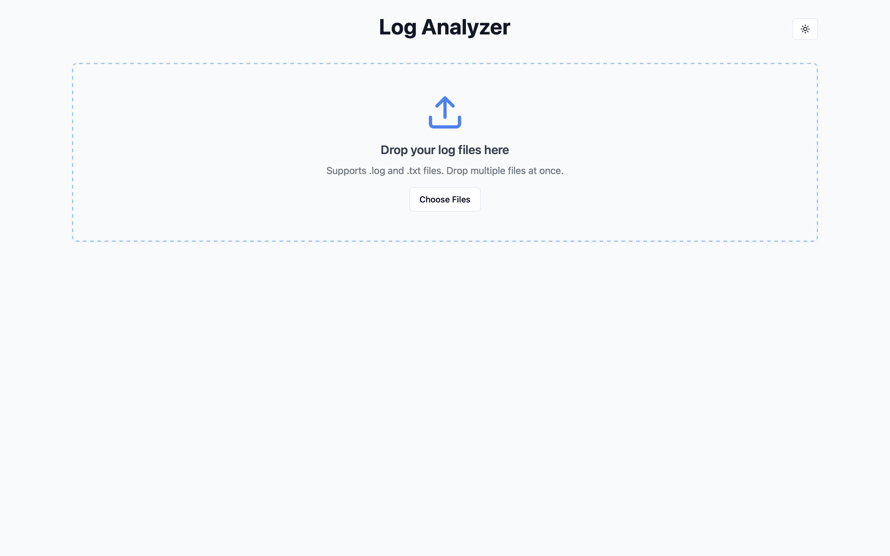

<h2 align="center">
  Log Analyzer<br/>
  <a href="https://github.com/NaderEmad9/log-analyzer" target="_blank">GitHub Repository</a>
</h2>


## Overview

**Log Analyzer** is a modern, offline-first desktop and web application for analyzing log files. It features powerful search, filtering, categorization, and a beautiful UI with dark mode support.  
Built with React, TypeScript, Tailwind CSS, shadcn/ui, and packaged for desktop with [Tauri](https://tauri.app/).

---

## Features

- 📂 Drag & drop log file upload (supports `.log` and `.txt`)
- 🔍 Full-text search across all logs
- 🏷️ Categorization: Error, Warning, Success/Info
- 🗓️ Date/time range filtering
- 📊 Dashboard with stats and summaries
- 🌙 Dark mode toggle
- ⚡ Fast, offline-first (PWA + Tauri desktop)
- 🖥️ Cross-platform: Web & Desktop (Windows, macOS, Linux)
- 🧩 Modular, customizable React components

---

## Screenshots

### 🌙 Dark Mode

<div align="center">
  
  <br/><br/>
  
  <br/><br/>
  
  <br/><br/>
  
</div>

### ☀️ Light Mode

<div align="center">
  
  <br/><br/>
  
  <br/><br/>
  
  <br/><br/>
  
</div>

---

## Getting Started

### Prerequisites

- [Node.js](https://nodejs.org/) (v18+ recommended)
- [npm](https://www.npmjs.com/) or [yarn](https://yarnpkg.com/)
- **Tauri prerequisites (for desktop build):**
  - **Windows:**
    - [Rust & Cargo](https://www.rust-lang.org/tools/install)
    - [Visual Studio Build Tools](https://visualstudio.microsoft.com/visual-cpp-build-tools/)
    - [WebView2](https://developer.microsoft.com/en-us/microsoft-edge/webview2/)
  - **macOS:**
    - [Rust & Cargo](https://www.rust-lang.org/tools/install)
    - Xcode Command Line Tools (`xcode-select --install`)
  - **Linux:**
    - [Rust & Cargo](https://www.rust-lang.org/tools/install)
    - `libwebkit2gtk-4.0-dev`, `build-essential`, `curl`, `wget`, `libssl-dev`, `libgtk-3-dev`, `libayatana-appindicator3-dev`, `librsvg2-dev`
  - See [Tauri's official guide](https://tauri.app/v1/guides/getting-started/prerequisites/) for more details.

### Installation (Web)

```sh
git clone https://github.com/NaderEmad9/log-analyzer.git
cd log-analyzer
npm install
npm run dev
```
Open [http://localhost:5173](http://localhost:5173) in your browser.

### Installation (Desktop via Tauri)

1. **Install Tauri prerequisites**  
   See [Tauri's official guide](https://tauri.app/v1/guides/getting-started/prerequisites/).

2. **Install dependencies**
   ```sh
   npm install
   ```

3. **Run in development mode**
   ```sh
   npm run tauri dev
   ```

4. **Build desktop app**
   ```sh
   npm run tauri build
   ```
   The installer/binary will be in the `src-tauri/target/release` directory.

---

## Usage

- Upload one or more log files via drag & drop or file picker.
- Use the dashboard to filter by error/warning/success.
- Search logs instantly.
- Filter by date/time range.
- Expand files to view and search individual log entries.
- Toggle dark mode for a comfortable viewing experience.

---

## Built With

- [React.js](https://react.dev/)
- [TypeScript](https://www.typescriptlang.org/)
- [Vite](https://vitejs.dev/)
- [Tailwind CSS](https://tailwindcss.com/)
- [shadcn/ui](https://ui.shadcn.com/)
- [Tauri](https://tauri.app/) (for desktop)
- [React Router](https://reactrouter.com/)

---

## Folder Structure

```
log-analyzer/
├── public/
├── src/
│   ├── components/
│   ├── pages/
│   ├── utils/
│   └── ...
├── src-tauri/           
├── screenshots/         
├── package.json
└── README.md
```

---

## Deployment

- **Web:** Deploy the `dist` folder to any static host (Vercel, Netlify, GitHub Pages, etc.)
  ```sh
  npm run build
  ```
- **Desktop:** Build with Tauri as above.

---

## License

This project is licensed under the MIT License.  
See the [LICENSE](./LICENSE) file for details.
